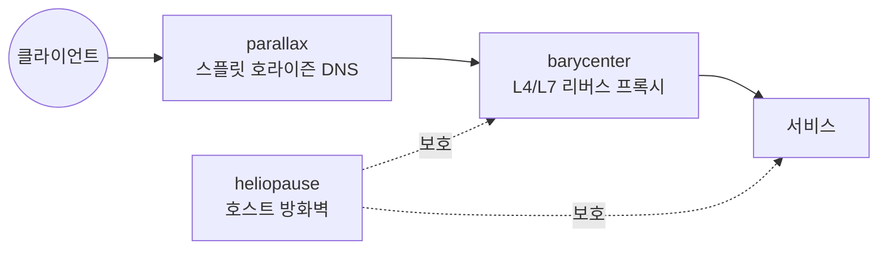

<picture>
  <source media="(prefers-color-scheme: dark)" srcset="https://raw.githubusercontent.com/henryj-dev/.github/main/profile/assets/banner-ko-dark.svg">
  <source media="(prefers-color-scheme: light)" srcset="https://raw.githubusercontent.com/henryj-dev/.github/main/profile/assets/banner-ko-light.svg">
  
</picture>

 

**한 번 기술하고, 안전하게 적용하고, 언제든 되돌릴 수 있는 인프라.**

  

<a href="https://github.com/henryj-dev">English</a> · <b>한국어</b>

---

보통은 서버 어딘가에서 손으로 고치는 설정 파일로 남아 있는 영역 — DNS 존, 리버스 프록시, 호스트 방화벽 — 을 위한 **컨트롤 플레인**을 만듭니다. 세 프로젝트 모두 같은 형태를 따릅니다. 원하는 상태를 선언하면, 컨트롤 플레인이 무엇이 바뀔지 먼저 보여주고, 되돌릴 수 있는 방식으로 적용합니다.

이름은 균형이 유지되는 지점, 또는 하나가 다른 하나에 자리를 내주는 경계에서 따왔습니다.

## 프로젝트

<table>
<tr>
<td width="33%" valign="top">

<h3><a href="https://github.com/henryj-dev/parallax">🛰️ parallax</a></h3>

<b>스플릿 호라이즌 DNS 컨트롤 플레인.</b> 내부 DNS와 Cloudflare를 하나의 desired state로 관리하며, 포털·API·CLI가 동등한 기능을 갖습니다.

<ul>
<li>결정적인 <code>managed-only</code> 조정 — 관리 대상이 아닌 레코드는 건드리지 않음</li>
<li>내장 리스너가 내부 뷰를 UDP/TCP로 응답</li>
<li>불변 리비전과 감사 이력, JSON 파일 또는 PostgreSQL 위에서 동작</li>
<li>OIDC 로그인 및 토큰 인증</li>
</ul>

</td>
<td width="33%" valign="top">

<h3><a href="https://github.com/henryj-dev/barycenter">⚖️ barycenter</a></h3>

<b>nginx를 위한 컨트롤 플레인.</b> HTTP, TCP, UDP 리버스 프록시와 로드 밸런싱을 설정 파일 더미가 아닌 하나의 모델로 관리합니다.

<ul>
<li>changeset → plan → commit → render → verify, 실패 시 롤백</li>
<li>시맨틱 플래닝으로 어떤 리스너와 세션이 영향받는지 표시</li>
<li>실제 L4 풀, 도메인 라우팅, SNI 패스스루</li>
<li>TLS 수명 주기: ACME 자동화 및 인증서 업로드</li>
</ul>

</td>
<td width="33%" valign="top">

<h3><a href="https://github.com/henryj-dev/heliopause">🛡️ heliopause</a></h3>

<b>스스로를 잠가버릴 수 없는 호스트 방화벽.</b> commit / confirm / 자동 롤백을 갖춘 선언형 nftables.

<ul>
<li>룰은 롤백 타이머를 걸고 적용되며, 접속 가능 여부를 재확인한 뒤에만 확정</li>
<li>자기 nftables 테이블만 다룸 — 전체 룰셋을 flush 하지 않음</li>
<li>에이전트는 Python 3 표준 라이브러리만으로 동작</li>
<li>ECDSA P-256 기반 mTLS 등록</li>
</ul>

</td>
</tr>
</table>

## 서로 어떻게 맞물리는지

각각 독립적으로 동작합니다. 어느 하나도 나머지를 요구하지 않습니다.

## 세 프로젝트의 공통점

| | |
|---|---|
| **명령이 아닌 desired state** | 무엇이 참이어야 하는지를 선언합니다. 조정은 컨트롤 플레인의 몫이며, 자신이 관리하는 대상 외에는 건드리지 않습니다. |
| **적용 전 계획** | 모든 변경은 미리 볼 수 있습니다. 무언가 움직이기 전에 영향 범위를 확인합니다. |
| **구조적으로 안전하게** | 롤백 타이머, commit/confirm, 렌더 후 검증. 사고를 내는 변경을 실수로 만들기 어렵게 설계했습니다. |
| **동등한 인터페이스** | GUI, API, CLI가 같은 제품입니다. 클릭으로만 되는 것도, 스크립트로만 되는 것도 없습니다. |
| **가벼운 의존성** | Node 위의 TypeScript, 표준 라이브러리만 쓰는 에이전트, 필요할 때의 Postgres. |

## 참여하기

모든 저장소에서 이슈와 풀 리퀘스트를 환영합니다. 실제 운영 중에 부족한 점을 발견하셨다면, 추상적인 기능 요청보다 사용 환경을 설명한 이슈가 훨씬 도움이 됩니다.

Apache-2.0 라이선스 · <a href="https://github.com/orgs/henryj-dev/repositories">전체 저장소 보기</a>

