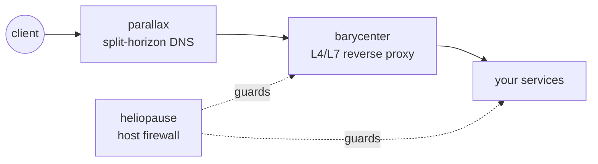

<picture>
  <source media="(prefers-color-scheme: dark)" srcset="https://raw.githubusercontent.com/henryj-dev/.github/main/profile/assets/banner-dark.svg">
  <source media="(prefers-color-scheme: light)" srcset="https://raw.githubusercontent.com/henryj-dev/.github/main/profile/assets/banner-light.svg">
  
</picture>

 

**Infrastructure you describe once, apply safely, and can always roll back.**

---

We build **control planes** for the parts of infrastructure that usually live as
hand-edited config files on a box somewhere: DNS zones, reverse proxies, host
firewalls. Each project takes the same shape — you declare the state you want,
the control plane shows you what will change, and it applies that change in a
way you can undo.

Named after the places where things stay in balance, or where one thing gives
way to another.

## Projects

<table>
<tr>
<td width="33%" valign="top">

<h3><a href="https://github.com/henryj-dev/parallax">🛰️ parallax</a></h3>

<b>Split-horizon DNS control plane.</b> One desired state for internal DNS and
Cloudflare, with a portal, API, and CLI of equal power.

<ul>
<li>Deterministic <code>managed-only</code> reconciliation — foreign records are left alone</li>
<li>Built-in listener answers the internal view over UDP/TCP</li>
<li>Immutable revisions and audit history, on JSON files or PostgreSQL</li>
<li>OIDC sign-in and token auth</li>
</ul>

</td>
<td width="33%" valign="top">

<h3><a href="https://github.com/henryj-dev/barycenter">⚖️ barycenter</a></h3>

<b>A control plane for nginx.</b> HTTP, TCP, and UDP reverse proxying and load
balancing managed as a model instead of a pile of config files.

<ul>
<li>Changeset → plan → commit → render → verify, with rollback on failure</li>
<li>Semantic planning shows which listeners and sessions a change touches</li>
<li>Real L4 pools, domain routing, SNI pass-through</li>
<li>TLS lifecycle: ACME automation and certificate upload</li>
</ul>

</td>
<td width="33%" valign="top">

<h3><a href="https://github.com/henryj-dev/heliopause">🛡️ heliopause</a></h3>

<b>A host firewall you can't lock yourself out of.</b> Declarative nftables with
commit / confirm / auto-rollback.

<ul>
<li>Rules apply with a rollback timer armed, confirmed only after reachability is re-verified</li>
<li>Touches only its own nftables table — never flushes your ruleset</li>
<li>Agent runs on the Python 3 standard library alone</li>
<li>mTLS enrollment with ECDSA P-256</li>
</ul>

</td>
</tr>
</table>

## How they fit together

Each one stands on its own — nothing here requires the others.

## What they have in common

| | |
|---|---|
| **Desired state, not commands** | You declare what should be true. Reconciliation is the control plane's job, and it only ever touches what it manages. |
| **Plan before apply** | Every change is previewable. You see the impact before anything moves. |
| **Safe by construction** | Rollback timers, commit/confirm, verification after render. The change that breaks things is hard to make by accident. |
| **Equal-power surfaces** | GUI, API, and CLI are the same product. Nothing is only clickable, nothing is only scriptable. |
| **Light on dependencies** | TypeScript on Node, a stdlib-only agent, Postgres when you want it. |

## Getting involved

Issues and pull requests are welcome on any repository. If you are running one
of these in anger and something is missing, an issue describing your setup is
more useful than a feature request in the abstract.

Apache-2.0 licensed · <a href="https://github.com/orgs/henryj-dev/repositories">browse all repositories</a>

